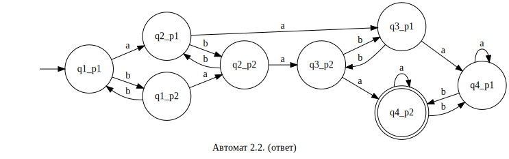
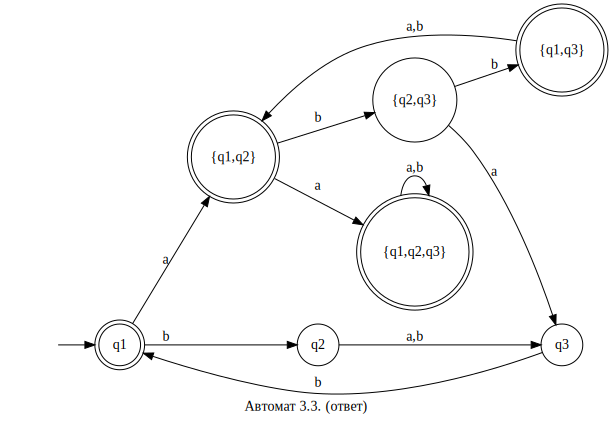

## Теоретические модели вычислений

***

## ДЗ  1

## Косарев А.А.

## А-05-19

___

## Задача 1 : Построить конечный автомат, распознающий язык. Автомат должен быть детерминированным.

Язык № 1:

Автомат № 1:

Язык № 2:

Автомат № 2:

Язык № 3:

Автомат № 3:

Автомат функционирует только если a и b чередуются. В противном случае, предполагаю, автомат построить невозможно.

Язык № 4:

Автомат № 4:

***

## Задача 2 : Построить конечный автомат, используя прямое произведение.

Язык № 1:

Разобьём на два автомата:

Автомат № 1:

Автомат № 2:

| -   | a   | b   |
| --- | --- | --- |
| q_1 | q_2 | q_1 |
| q_2 | q_3 | q_2 |
| q_3 | q_3 | q_3 |

| -   | a   | b   |
| --- | --- | --- |
| p_1 | p_1 | p_2 |
| p_2 | p_2 | p_3 |
| p_3 | p_3 | p_3 |

| -         | a         | b         |
|:--------- | --------- | --------- |
| <q_1,p_1> | <q_2,p_1> | <q_1,p_2> |
| <q_1,p_2> | <q_2,p_2> | <q_1,p_3> |
| <q_1,p_3> | <q_2,p_3> | <q_1,p_3> |
| <q_2,p_1> | <q_3,p_1> | <q_2,p_2> |
| <q_2,p_2> | <q_3,p_2> | <q_2,p_3> |
| <q_2,p_3> | <q_3,p_3> | <q_2,p_3> |
| <q_3,p_1> | <q_3,p_1> | <q_3,p_2> |
| <q_3,p_2> | <q_3,p_2> | <q_3,p_3> |
| <q_3,p_3> | <q_3,p_3> | <q_3,p_3> |

Результирующий автомат, полученный прямым произведением вышеизложенных автоматов:

Язык № 2:

Разобьём на два автомата:

Автомат № 1:

Автомат № 2:

| -   | a   | b   |
| --- | --- | --- |
| q_1 | q_2 | q_1 |
| q_2 | q_3 | q_2 |
| q_3 | q_4 | q_3 |
| q_4 | q_4 | q_4 |

| -   | a   | b   |
| --- | --- | --- |
| p_1 | p_1 | p_2 |
| p_2 | p_2 | p_1 |

| -         | a         | b         |
| --------- | --------- | --------- |
| <q_1,p_1> | <q_2,p_1> | <q_1,p_2> |
| <q_1,p_2> | <q_2,p_2> | <q_1,p_1> |
| <q_2,p_1> | <q_3,p_1> | <q_2,p_2> |
| <q_2,p_2> | <q_3,p_2> | <q_2,p_1> |
| <q_3,p_1> | <q_4,p_1> | <q_3,p_2> |
| <q_3,p_2> | <q_4,p_2> | <q_3,p_1> |
| <q_4,p_1> | <q_4,p_1> | <q_4,p_2> |
| <q_4,p_2> | <q_4,p_2> | <q_4,p_1> |

Результирующий автомат, полученный прямым произведением вышеизложенных автоматов:

Язык № 3:

Разобьём на два автомата:

Автомат № 1:

Автомат № 2:

| -   | a   | b   |
| --- | --- | --- |
| q_1 | q_2 | q_1 |
| q_2 | q_1 | q_2 |

| -   | a   | b   |
| --- | --- | --- |
| p_1 | p_1 | p_2 |
| p_2 | p_2 | p_3 |
| p_3 | p_3 | p_1 |

| -         | a         | b         |
| --------- | --------- | --------- |
| <q_1,p_1> | <q_2,p_1> | <q_1,p_2> |
| <q_1,p_2> | <q_2,p_2> | <q_1,p_3> |
| <q_1,p_3> | <q_2,p_3> | <q_1,p_1> |
| <q_2,p_1> | <q_1,p_1> | <q_2,p_2> |
| <q_2,p_2> | <q_1,p_2> | <q_2,p_3> |
| <q_2,p_3> | <q_1,p_3> | <q_2,p_1> |

Результирующий автомат, полученный прямым произведением вышеизложенных автоматов:

Язык № 4:

Заменим терминальные состояния на терминальные и наоборот и получим требуемый автомат:

Язык № 5:

Раскроем разность через пересечение:

Найдем прямое произведение

Автомат № 1:

(в функции перехода сразу переименуем состояния, чтобы в последующем не писать по 4 буквы)

| -   | a   | b   |
| --- | --- | --- |
| f_1 | f_3 | f_2 |
| f_2 | f_4 | f_1 |
| f_3 | f_5 | f_4 |
| f_4 | f_6 | f_3 |
| f_5 | f_7 | f_6 |
| f_6 | f_8 | f_5 |
| f_7 | f_7 | f_8 |
| f_8 | f_8 | f_7 |

Автомат № 2:

(в функции перехода сразу переименуем состояния, чтобы в последующем не писать по 4 буквы)

| -   | a   | b   |
| --- | --- | --- |
| g_1 | g_4 | g_2 |
| g_2 | g_5 | g_3 |
| g_3 | g_6 | g_1 |
| g_4 | g_1 | g_5 |
| g_5 | g_2 | g_6 |
| g_6 | g_3 | g_4 |

| -         | a         | b         |
| --------- | --------- | --------- |
| <f_1,g_1> | <f_3,g_4> | <f_2,g_2> |
| <f_1,g_2> | <f_3,g_5> | <f_2,g_3> |
| <f_1,g_3> | <f_3,g_6> | <f_2,g_1> |
| <f_1,g_4> | <f_3,g_1> | <f_2,g_5> |
| <f_1,g_5> | <f_3,g_2> | <f_2,g_6> |
| <f_1,g_6> | <f_3,g_3> | <f_2,g_4> |
| <f_2,g_1> | <f_4,g_4> | <f_1,g_2> |
| <f_2,g_2> | <f_4,g_5> | <f_1,g_3> |
| <f_2,g_3> | <f_4,g_6> | <f_1,g_1> |
| <f_2,g_4> | <f_4,g_1> | <f_1,g_5> |
| <f_2,g_5> | <f_4,g_2> | <f_1,g_6> |
| <f_2,g_6> | <f_4,g_3> | <f_1,g_4> |
| <f_3,g_1> | <f_5,g_4> | <f_4,g_2> |
| <f_3,g_2> | <f_5,g_5> | <f_4,g_3> |
| <f_3,g_3> | <f_5,g_6> | <f_4,g_1> |
| <f_3,g_4> | <f_5,g_1> | <f_4,g_5> |
| <f_3,g_5> | <f_5,g_2> | <f_4,g_6> |
| <f_3,g_6> | <f_5,g_3> | <f_4,g_5> |
| <f_4,g_1> | <f_6,g_4> | <f_3,g_2> |
| <f_4,g_2> | <f_6,g_5> | <f_3,g_3> |
| <f_4,g_3> | <f_6,g_6> | <f_3,g_1> |
| <f_4,g_4> | <f_6,g_1> | <f_3,g_5> |
| <f_4,g_5> | <f_6,g_2> | <f_3,g_6> |
| <f_4,g_6> | <f_6,g_3> | <f_3,g_4> |
| <f_5,g_1> | <f_7,g_4> | <f_6,g_2> |
| <f_5,g_2> | <f_7,g_5> | <f_6,g_3> |
| <f_5,g_3> | <f_7,g_6> | <f_6,g_1> |
| <f_5,g_4> | <f_7,g_1> | <f_6,g_5> |
| <f_5,g_5> | <f_7,g_2> | <f_6,g_6> |
| <f_5,g_6> | <f_7,g_3> | <f_6,g_4> |
| <f_6,g_1> | <f_8,g_4> | <f_5,g_2> |
| <f_6,g_2> | <f_8,g_5> | <f_5,g_3> |
| <f_6,g_3> | <f_8,g_6> | <f_5,g_1> |
| <f_6,g_4> | <f_8,g_1> | <f_5,g_5> |
| <f_6,g_5> | <f_8,g_2> | <f_5,g_6> |
| <f_6,g_6> | <f_8,g_3> | <f_5,g_4> |
| <f_7,g_1> | <f_7,g_4> | <f_8,g_2> |
| <f_7,g_2> | <f_7,g_5> | <f_8,g_3> |
| <f_7,g_3> | <f_7,g_6> | <f_8,g_1> |
| <f_7,g_4> | <f_7,g_1> | <f_8,g_5> |
| <f_7,g_5> | <f_7,g_2> | <f_8,g_6> |
| <f_7,g_6> | <f_7,g_3> | <f_8,g_4> |
| <f_8,g_1> | <f_8,g_4> | <f_7,g_2> |
| <f_8,g_2> | <f_8,g_5> | <f_7,g_3> |
| <f_8,g_3> | <f_8,g_6> | <f_7,g_1> |
| <f_8,g_4> | <f_8,g_1> | <f_7,g_5> |
| <f_8,g_5> | <f_8,g_2> | <f_7,g_6> |
| <f_8,g_6> | <f_8,g_3> | <f_7,g_4> |

Результирующий автомат, полученный прямым произведением вышеизложенных автоматов:

## Задача 3 : Построить минимальный ДКА по регулярному выражению.

Регулярное выражение № 1:

%5E*a)

Сперва построим недетерминированный конечный автомат, а затем преобразуем его в детерминированный.

НКА:

Теперь составим таблицу для преобразования НКА в ДКА:

|              | a            | b     |
| ------------ | ------------ | ----- |
| q1           | q3,q7,q10    | -     |
| q3,q7,q10    | -            | q4,q8 |
| q4,q8        | q3,q5,q10,q7 | -     |
| q3,q5,q10,q7 | q3,q7,q10    | q4,q8 |

Получаем ДКА:

Регулярное выражение № 2:

%5E*b)%5E*(ab)%5E*)

Сперва построим недетерминированный конечный автомат, а затем преобразуем его в детерминированный.

НКА:

Теперь составим таблицу для преобразования НКА в ДКА:

|       | a     | b     |
| ----- | ----- | ----- |
| q1    | q2    | -     |
| q2    | q3    | -     |
| q3    | q4    | q6    |
| q4    | -     | q5    |
| q6    | q3,q7 | -     |
| q5    | q4    | q6    |
| q3,q7 | q4    | q6,q8 |
| q6,q8 | q3,q7 | -     |

Получаем ДКА:

Регулярное выражение № 3:

(a&plus;b)b)%5E*)

Сперва построим недетерминированный конечный автомат, а затем преобразуем его в детерминированный.

НКА:

Теперь составим таблицу для преобразования НКА в ДКА:

|          | a        | b        |
| -------- | -------- | -------- |
| q1       | q1,q2    | q2       |
| q1,q2    | q1,q2,q3 | q2,q3    |
| q2       | q3       | q3       |
| q1,q2,q3 | q1,q2,q3 | q1,q2,q3 |
| q2,q3    | q3       | q1,q3    |
| q3       | -        | q1       |
| q1,q3    | q1,q2    | q1,q2    |

Получаем ДКА:

Регулярное выражение № 4:

((ab)%5E*c&plus;(ba)%5E*)%5E*)

Можем сразу построить ДКА:

## Задача 4 : Определить является ли язык регулярным или нет

Язык № 1:

%5Enb(aba)%5Em%20%5Cmid%20n%20%5Cgeq%20%200,%20m%20%5Cgeq%20%200%5C%7D)

Язык является регулярным.

Язык № 2:

Лемма о накачке:

Отрицание:

Возьмём слово

Тогда

"Накачка" y:

%5Eib%5E%7Bn-k-m%7Daaa%5En%5C%5Ci=0%5C;%5C;%5CRightarrow%20%5C;%5C;%20%5Comega_0%20=b%5E%7Bn-m%7Daaa%5En%5C%5Cm%5Cneq%200%5C;%5C;%5CRightarrow%20%5Comega_0%5Cnotin%20L%20)

Следовательно, язык не является регулярным.

Язык № 3:

Лемма о накачке:

Отрицание:

Возьмём слово

Тогда

"Накачка" y:

%5Eia%5E%7Bn-k-m%7Db%5En%5C%5Ci=0%5C;%5C;%5CRightarrow%20%5C;%5C;%20%5Comega_0%20=a%5E%7Bn-m%7Db%5En%5C%5Cm%5Cneq%200%5C;%5C;%5CRightarrow%20%5Comega_0%5Cnotin%20L)

Следовательно, язык не является регулярным.

Язык № 4:

Лемма о накачке:

Отрицание:

Возьмём слово

Тогда

"Накачка" y:

%5Eia%5E%7Bn-k-m%7Dba%5En%5C%5Ci=2%5C;%5C;%5CRightarrow%20%5C;%5C;%20%5Comega_2%20=a%5E%7Bn&plus;m%7Dba%5En%5C%5Cm%5Cneq%200%5C;%5C;%5CRightarrow%20%5Comega_2%5Cnotin%20L)

Следовательно, язык не является регулярным.

Язык № 5:

Лемма о накачке:

Отрицание:

Возьмём слово

%5Enc(ab)%5En%20=%20s_1s_2...s_n...s_%7B2n%7D...s_%7B4n%7Ds_%7B4n&plus;1%7D,%20%5Cforall%20n%5C%5C%5Cleft%7C%5Comega%20%20%5Cright%7C%20%5Cgeqslant%20n)

Тогда

(s_%7Bk&plus;1%7Ds_%7Bk&plus;2%7D...s_%7Bk&plus;m%7D),%20%5C:%5C:k&plus;m%5Cleq%20n,%20%5C:%5C:m%5Cneq%200%5C%5C%5Comega%20=(s_1s_2...s_k)(s_%7Bk&plus;1%7Ds_%7Bk&plus;2%7D...s_%7Bk&plus;m%7D)(s_%7Bk&plus;m&plus;1%7Ds_%7Bk&plus;m&plus;2%7D...s_%7B2n%7Dc(ab)%5En))

"Накачка" y:

(s_%7Bk&plus;1%7Ds_%7Bk&plus;2%7D...s_%7Bk&plus;m%7D)%5Ei(s_%7Bk&plus;m&plus;1%7Ds_%7Bk&plus;m&plus;2%7D...s_%7B2n%7Dc(ab)%5En)%5C%5Ci=2%5C;%5C;%5CRightarrow%20%5C;%5C;%20%5Comega_2%20=(s_1s_2...s_k)(s_%7Bk&plus;1%7Ds_%7Bk&plus;2%7D...s_%7Bk&plus;m%7D)%5E2(s_%7Bk&plus;m&plus;1%7Ds_%7Bk&plus;m&plus;2%7D...s_%7B2n%7Dc(ab)%5En)%5C%5Cm%5Cneq%200%5C;%5C;%5CRightarrow%20%5Comega_2%5Cnotin%20L)

Следовательно, язык не является регулярным.